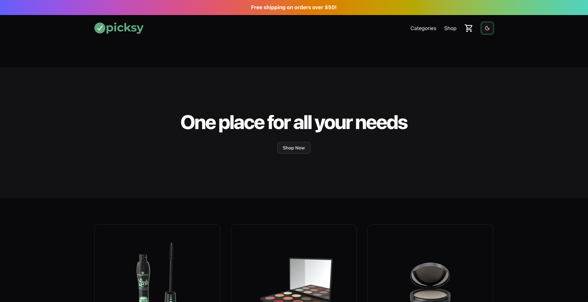

# PICKSY E-COMMERCE

A fully responsive e-commerce web application built with Next.js, Tailwind CSS, and modern React tools. This project includes product listing, dynamic filtering, navigation menus, theme switching, a global cart system, and more.

## 🛠️ Technologies Used

- Next.js
- React
- Tailwind CSS
- Shadcn/UI
- Context API
- React Icons
- Sonner (Toast notifications)

## How It Works

Todos are stored in the browser's LocalStorage, allowing your list to remain even after refreshing the page.
Each todo can be customized by changing its color or deleted anytime.

## Features

- Next.js App Router architecture

- Dynamic product filtering (search, category, sorting)

- Category filtering synced with URL using useSearchParams

- Mobile & desktop navigation menus with outside-click closing

- Dark/Light/System theme toggle using next-themes

- Global cart state using Context API

- Shadcn/UI components for clean UI

- Responsive layout with Tailwind CSS

- Loading skeletons for product cards

- Breadcrumb navigation for improved UX

## 💡 Future Improvements

- Wishlist feature
- Authentication & user accounts

## Demo

[Live Preview](https://picksy-psi.vercel.app/)

## 🔍 Key Functionalities

#### 🔸 Product Filtering

- Search by name
- Filter by category
- Sort by price: lowest, highest, or recommended
- Category selection updates the URL without page refresh

#### 🔸 Navigation Menu

- Desktop dropdown closes when clicking outside
- Mobile menu automatically closes after selecting any link

#### 🔸 Theme Toggle

- Switch between Light, Dark, and System themes using next-themes.

#### 🔸 Cart System

- Total items count displayed in navbar
- Managed globally through Context API
